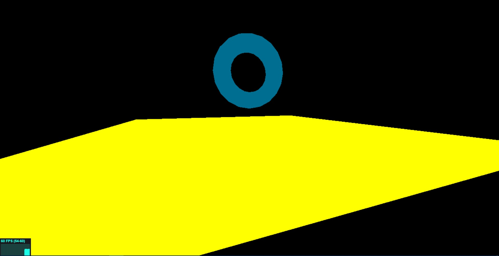

### First plugin
Now we have plugin support in *WhitestormJS* !

Plugin example: [http://192.241.128.187/current/examples/plugin_example.html](http://192.241.128.187/current/examples/plugin_example.html)



### How to setup

Register your plugin:

```javascript

WHS.plugins.register("pluginName", function(time) {
	// Your code here.
});

```

Then run it on your WHS object:

```javascript

sphere.pluginName();

```

Your object will be available throught `this` variable in code.
Animation you can implement with *loops*.

### Loops. For animation in plugins.

```javascript

var sphere = GAME.addObject("sphere",
{
    geometryOptions: {
        radius:3 // Sphere radius
    },
    onlyvis: true, // Without physics
    materialOptions: { // ThreeJs material options
        color: 0xffffff,
        type: "basic"
    },
    pos: { // position in space
        x: 0,
        y: 0,
        z: 0
    }
});

WHS.plugins.register("changePostion", function(time) {
	var object = this;

    var animation = new WHS.plugins.loop(function() {}
        object.visible.position.x+=1;

        if(object.position.x >= 20)
        	animation.stop();
    });

    animation.start();
});

sphere.changePosition();

``` 


This code will change sphere's position until x coordinate will reach 20. After that loop will stop.