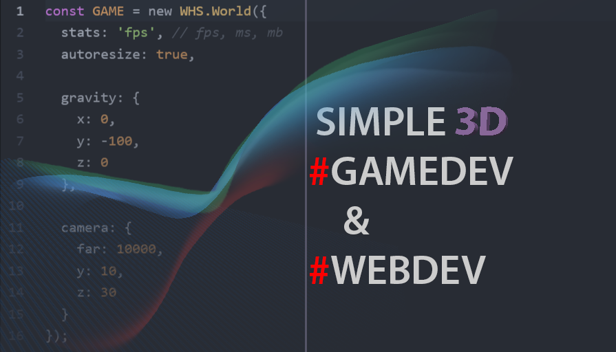
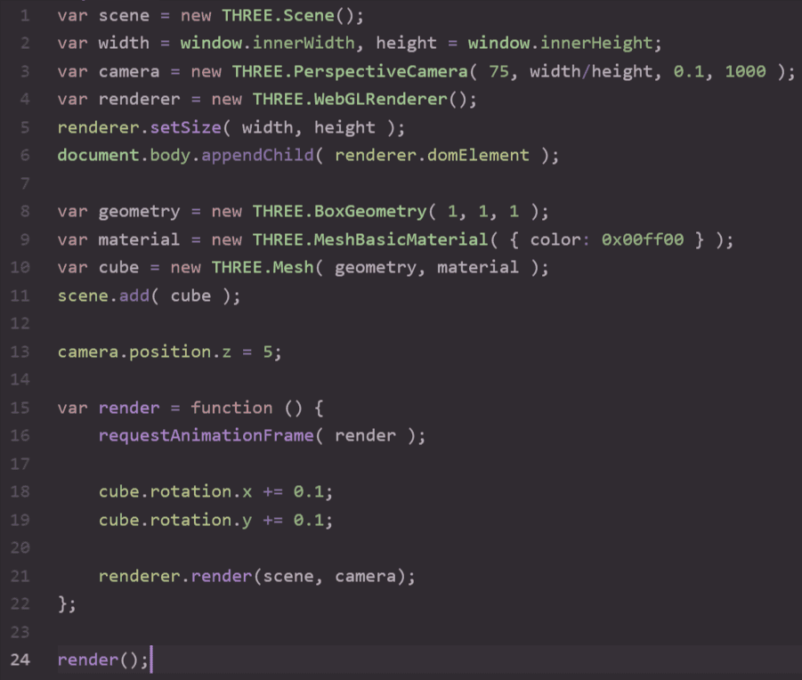
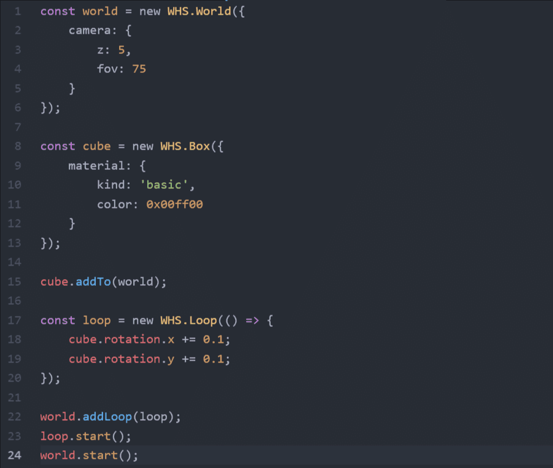

<h1 class="bigline">Introduction</h1>

<div class="blockTitle h3">EXAMPLES</div>
> BASIC:
>
> * [Basic / Hello world](http://192.241.128.187/current/examples/basic/helloworld/)  (Basic "Hello world!" example.)
> * [Basic / Model](http://192.241.128.187/current/examples/basic/model/)  (Basic model example.)
> * [Basic / Debugging](http://192.241.128.187/current/examples/basic/debugging/)  (Object's debug example.)
> * [Basic / Extending API](http://192.241.128.187/current/examples/basic/extending/)  (Extending api example.)
> * [Basic / Softbody](http://192.241.128.187/current/examples/basic/softbody/)  (Basic softbody implementation.)
> * [Basic / Three.js](http://192.241.128.187/current/examples/basic/threejs/)  (Importing three.js scene to whitestormjs core.)
>
> DESIGN:
>
> * [Design / Saturn](http://192.241.128.187/current/examples/design/saturn/)  (Saturn planet example from [codepen](http://codepen.io/Yakudoo/pen/qbygaJ))
> * [Design / Easter](http://192.241.128.187/current/examples/design/easter/)  (Easter rabbit with easter eggs.)
>  * [Design / Points](http://192.241.128.187/current/examples/design/points/)  (Using WHS.Points to make a point cloud shaped in cube.)
>
> FIRST-PERSON:
>
> * [FPS / Shooter](http://192.241.128.187/current/examples/fps/shooter/)  (First person game with animated objects) 
> * [FPS / Fog](http://192.241.128.187/current/examples/fps/fog/)  (First person example with Wagner effects and terrain. + fog)
>
> PHYSICS:
>
> * [Physics / Dominos](http://192.241.128.187/current/examples/physics/domino/)  (Physics example with dominos.)
>
> PERFORMANCE:
>
> * [Performance / Sticks](http://192.241.128.187/current/examples/performance/sticks/)  (Collisions performance of 320 basic box objects.)

**WhitestormJS** is a framework for 3D web apps built with Three.js technology.

It implements a core with component system and plugin support for fast development of 3D scene with physics.

Automizing your web app with whitestorm is fast and comfortable. This engine has physics support implemented by custom Physi.js library, which is much faster than others. Framework provides extended component control and high frame rate, because it uses [WebWorkers technology](https://developer.mozilla.org/en-US/docs/Web/API/Web_Workers_API/Using_web_workers) for multithreading.

#### FRAMEWORKS GOAL

We want simplify your coding workflow and add plugin's feature to 3D part of the web.



#### SIMPLE IS BETTER

Each time you want to develop even a basic application - you need to describe every 3D part of it, such as renderer, frame updating, include external physics, write autoresize if needed. This time we want you to make all it much easier with best performance and functionality. You still can manage all of them, but if you forgot to do that, or just don't need it - whitestorm.js will do all it for you.

# Getting started

## Install & usage

<div class="blockTitle h2">HTML</div>
```html
<!-- WhitestormJS library -->
<script src="whitestorm.js"></script>
<!-- App written in WhitestormJS -->
<script src="app.js"></script>
```

<div class="blockTitle h2">JAVASCRIPT (app.js) | <a target="_blank" href="http://whitestormjs.xyz/playground/?code=const%20world%20=%20new%20WHS.World(%7B%0D%0A%20%20autoresize:%20true,%0D%0A%20%20%0D%0A%20%20background:%20%7B%0D%0A%20%20%20%20color:%200xffffff%0D%0A%20%20%7D,%0D%0A%0D%0A%20%20gravity:%20%7B%20//%20Physic%20gravity.%0D%0A%20%20%20%20x:%200,%0D%0A%20%20%20%20y:%20-100,%0D%0A%20%20%20%20z:%200%0D%0A%20%20%7D,%0D%0A%0D%0A%20%20camera:%20%7B%0D%0A%20%20%20%20z:%2050%0D%0A%20%20%7D%0D%0A%7D);%0D%0A%0D%0Aconst%20sphere%20=%20new%20WHS.Sphere(%7B%20//%20Create%20sphere%20object.%0D%0A%20%20geometry:%20%7B%0D%0A%20%20%20%20radius:%203%0D%0A%20%20%7D,%0D%0A%0D%0A%20%20mass:%2010,%0D%0A%0D%0A%20%20material:%20%7B%0D%0A%20%20%20%20color:%200x00ff00,%0D%0A%20%20%20%20kind:%20'basic'%0D%0A%20%20%7D%0D%0A%7D);%0D%0A%0D%0Asphere.addTo(world);%0D%0Asphere.getNative();%20//%20Returns%20THREE.Mesh%20of%20this%20object.%0D%0A%0D%0Aworld.start();%20//%20Start%20animations%20and%20physics%20simulation.">PLAYGROUND</a></div>
```javascript

const world = new WHS.World({
  autoresize: true,
  
  background: {
    color: 0xffffff
  },

  gravity: { // Physic gravity.
    x: 0,
    y: -100,
    z: 0
  },

  camera: {
    z: 50
  }
});

const sphere = new WHS.Sphere({ // Create sphere object.
  geometry: {
    radius: 3
  },

  mass: 10,

  material: {
    color: 0x00ff00,
    kind: 'basic'
  }
});

sphere.addTo(world);
sphere.getNative(); // Returns THREE.Mesh of this object.

world.start(); // Start animations and physics simulation.

```

```coffeescript

world = new (WHS.World)(
  autoresize: true
  background: color: 0xffffff
  gravity:
    x: 0
    y: -100
    z: 0
  camera: z: 50)
sphere = new (WHS.Sphere)(
  geometry: radius: 3
  mass: 10
  material:
    color: 0x00ff00
    kind: 'basic')
sphere.addTo world

sphere.getNative()
# Returns THREE.Mesh of this object.

world.start()
# Start animations and physics simulation.


```

> It's better to inlude whitestorm.js file before the end of body tag. It will force page to load content first. Your code should come after whitestorm.js included.

Whitestorm.js uses Three.js for rendering your scene and objects and Physi.js for simulating physics. Both those libraries are already included in build and should work properly. You can also make your own build that will satisfy your needs by playing with whitestorm.js [build configuration file](https://github.com/WhitestormJS/whitestorm.js/blob/master/webpack.config.babel.js) and [CLI commands](https://github.com/WhitestormJS/whitestorm.js/blob/master/.github/CONTRIBUTING.md#cli)

<aside class="notice">It is advised to <b>download your own copies of the following libraries</b>, as large changes can break backwards compatibility.</aside>

<aside class="notice">You may <b>run latest versions</b> of whitestorm.js and your browser or other environment where you are going to use your application to achieve best performance results. </aside>

To create whitestorm.js app you should make a basic HTML document with `html`, `head` and `body` tags. Next step is to include Whitestorm.js to the document and main app script file. You can do it simply using `script` tag (see right side) for more details. 

We love to create awesome things and we noticed that we can reduce code for setting up basic things like world or box. That's why we developed API that powers your development proccess by wrapping existing three.js API.

#### WHITESTORM.JS CODE VS THREE.JS NATIVE CODE

<figure class="cd-image-container is-visible">
    
    <span class="cd-image-label" data-type="original">Three.js</span>
    <div class="cd-resize-img" style="width: 47.916665%;">
      
      <span class="cd-image-label" id="whslabel" data-type="modified">Whitestorm.js</span>
    </div>
    <span class="cd-handle" style="left: 47.916665%;"></span>
</figure>

#### ENVIRONMENT

<a href="https://www.google.com/chrome/browser/desktop/index.html"></a>
<a href="http://electron.atom.io/"></a>
<a href="https://www.mozilla.org/en-US/firefox/new/"></a>
<a href="https://cordova.apache.org/"></a>
<a href="http://www.opera.com/"></a>
<a href="http://phonegap.com/"></a>

## Usage with webpack

It is possible to use Whitestorm.js with webpack. To do this you should add some lines in your [webpack](https://webpack.github.io/) config:

### Usage with physics (see <a href="#variations">variations</a>):

```javascript

plugins: [
  new webpack.NormalModuleReplacementPlugin(/inline\-worker/, 'webworkify-webpack')
  // ...
],

```

Add `new webpack.NormalModuleReplacementPlugin(/inline\-worker/, 'webworkify-webpack')` to plugins section in webpack config. 

#### EXPLANATION
Currently we use [InlineWorker](https://www.npmjs.com/package/inline-worker) to maintain Web Workers in node environment. Same thing with InlineWorker is possible in webpack too, but dependencies wouldn't be accessible from `worker.js` file. To solve this problem we use special plugin: [webworkify-webpack](https://www.npmjs.com/package/webworkify-webpack). This plugin is already included to whitestorm's `package.json` so there is no need to install it again.

### Light version (see <a href="#variations">variations</a>):

```javascript

externals: {
  '../physics/index.js': 'var false',
  './physics/index.js': 'var false'
},

```

To use whitestorm.js without including Physi.js you should add it's paths as externals in webpack config (look to the right for code). It will remove all Physi.js files and Ammo.js and will let you use a more lightweight bundle.

### Source code on GitHub

You may also check implementation of Whitestorm.js with webpack at **[GitHub]** [WhitestormJS/test-whitestorm-webpack](https://github.com/WhitestormJS/test-whitestorm-webpack) for more details. You will find also notes about compressing bundle there.

- **webpack.config.js** - this one is configuration for bundle with physics support.
- **webpack.light.config.js** - this one is configuration for bundle without physics support and ammo.js included.


# Core


